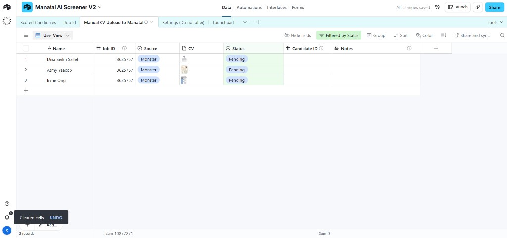
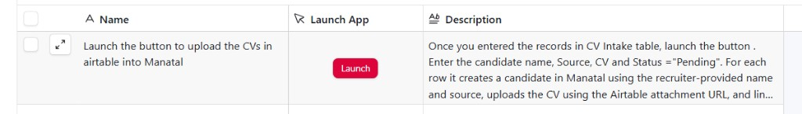
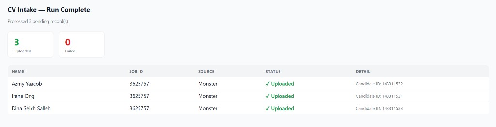
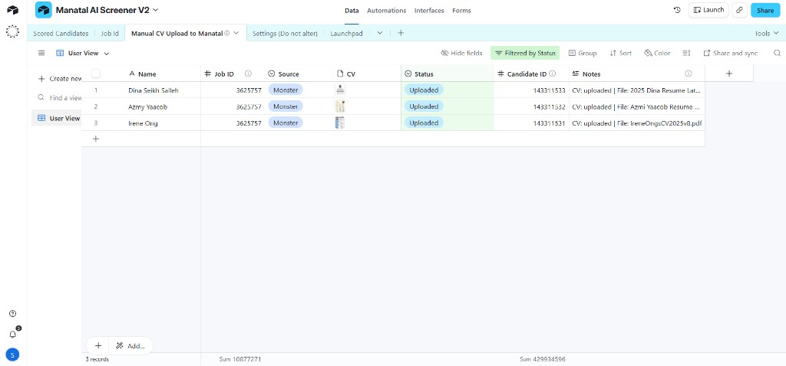
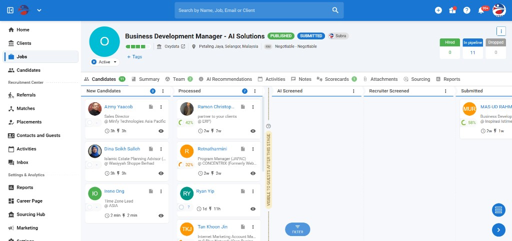

# Manatal CV Intake — Standard Operating Procedure

**Date:** March 25, 2026

---

## Purpose

This document describes how to use the Manatal CV Intake system to upload candidate CVs from Airtable into Manatal. It covers preparing intake rows, triggering the upload, reviewing results, and verifying that candidates appear in Manatal.

**By the end of each run you should have:**

- All pending candidates created in Manatal with their CVs attached
- Each candidate matched to the correct job in Manatal
- Every processed row in Airtable updated to **Uploaded** (success) or **Failed** (with a reason)
- A Candidate ID recorded in Airtable for each successful upload

---

## 1. System Overview

The CV Intake system connects two tools you already use:

- **Airtable** — where you enter candidate information and attach CVs
- **Manatal** — your applicant tracking system where candidates are managed

The workflow is simple: you fill in rows in Airtable, click a button, and the system automatically creates each candidate in Manatal, attaches their CV, and links them to the right job. You see a live progress page in your browser and can check the results in both Airtable and Manatal.

After you click the button, a browser tab opens and the system processes all pending rows. Once complete, you see a **Results screen** — a table showing the outcome for every row, with summary counts of how many were uploaded and how many failed.

*Airtable intake table with Name, Job ID, Source, CV, Status, Candidate ID, and Notes columns*

---

## 2. Primary SOP — Step by Step

### Stage A — Prepare Intake Rows in Airtable

**1. Open the Airtable intake table.**

Open Airtable and navigate to the CV Intake base and table. You will see columns for Name, Job ID, Source, CV, Status, Candidate ID, and Notes.

**2. Add a new row for each candidate.**

Fill in the following fields:

| Field | What to enter |
|-------|---------------|
| **Name** | The candidate's full name (required) |
| **Job ID** | The numeric Manatal Job ID this candidate should be matched to (required) |
| **Source** | Where the candidate came from, e.g. "Monster", "LinkedIn", "Referral" |

**3. Attach the candidate's CV.**

Click the **CV** attachment field and upload or drag-and-drop the candidate's CV file (PDF or Word document). Only one file per row is needed — the system uses the first attachment.

**4. Confirm the Status is "Pending".**

Make sure the **Status** column shows **Pending** for every row you want to process. Only rows with this status will be picked up in the next run.

#### What success looks like

- Each row has a **Name**, **Job ID**, and a **CV** file attached
- The **Status** column shows **Pending** for all rows you want to process
- The **Source** field is filled in (if left blank, it defaults to "Monster")

*Airtable table with rows filled in — Status showing "Pending" and CV files attached*

---

### Stage B — Trigger the Intake

**5. Click the intake button in Airtable.**

In your Airtable view, click the button that triggers the CV Intake. This opens a new browser tab that connects to the intake system.

*The "Launch" button in Airtable that triggers the CV Intake*

**6. Wait for processing to complete.**

Your browser will show a brief loading indicator while the system processes the pending rows. Do not close this tab — the results page will appear automatically once processing is complete.

#### What success looks like

- A new browser tab opens after clicking the button
- The page loads and shows the results within a few seconds

---

### Stage C — Review Results

**7. Wait for the results page to load.**

The results summary will appear once all rows have been processed. This typically takes a few seconds per candidate, depending on how many are in the batch.

**8. Review the results table.**

The results page shows:

- **Summary cards** at the top — total Uploaded (green) and Failed (red) counts
- **Results table** with one row per candidate, showing:

| Column | What it shows |
|--------|---------------|
| **Name** | The candidate's name |
| **Job ID** | The Manatal Job ID |
| **Source** | The candidate source |
| **Status** | Green checkmark with "Uploaded" or red X with "Failed" |
| **Detail** | On success: the Manatal Candidate ID. On failure: the reason (e.g., "Name is empty") |

#### What success looks like

- The results table appears on the page
- All rows show a green **Uploaded** status
- Each uploaded row has a **Candidate ID** in the Detail column

*Results page showing 3 Uploaded, 0 Failed — with Candidate IDs in the Detail column*

---

### Stage D — Verify in Airtable and Manatal

**9. Return to Airtable and confirm the updates.**

Switch back to your Airtable tab and refresh the page. For each processed row, check that:

- **Status** has changed from "Pending" to **Uploaded** (or **Failed** if there was a problem)
- **Candidate ID** is filled in with the Manatal candidate ID (for uploaded rows)
- **Notes** contains processing details (e.g., the CV filename and upload status)

#### What success looks like

- No rows still show "Pending" — they are all either "Uploaded" or "Failed"
- Uploaded rows have a numeric **Candidate ID**
- The **Notes** field shows something like "CV: uploaded | File: resume.pdf"

*Airtable after a run — Status updated to "Uploaded", Candidate IDs filled in, and Notes populated*

**10. Verify in Manatal.**

Open Manatal and search for one or more of the candidates you just uploaded. Confirm that:

- The candidate profile exists with the correct name
- Their CV/resume is attached
- They are matched to the correct job

*Manatal job pipeline showing uploaded candidates (Azmy Yaacob, Dina Seikh Salleh, Irene Ong) in the New Candidates stage*

---

## 3. Alternative Flows

### Re-running Failed Rows

If some rows show **Failed** after a run:

1. Go to the failed row in Airtable
2. Read the **Notes** column to understand why it failed (e.g., "Name is empty", "No CV attached", "Job ID is empty")
3. Fix the issue — fill in the missing field or attach the CV
4. Change the **Status** back to **Pending**
5. Trigger the intake button again (Stage B, Step 5)

Only rows with Status = "Pending" will be processed, so your previously successful rows will not be affected.

### Testing with a Single Row

To test the system with one candidate before running a full batch:

1. Make sure only **one** row has Status = **Pending**
2. Change all other rows to a different status (e.g., "On Hold" or clear the field)
3. Trigger the intake button
4. Verify the single candidate in the results page, Airtable, and Manatal
5. Once confirmed, set your remaining rows back to **Pending** and run again

---

## 4. Airtable Output Field Reference

After the intake runs, the following Airtable fields are updated automatically:

| Field | Possible Values | Meaning |
|-------|----------------|---------|
| **Status** | **Uploaded** | The candidate was successfully created in Manatal, CV attached, and matched to the job |
| | **Failed** | Something went wrong — see the Notes field for details |
| **Candidate ID** | A number (e.g., 123456) | The Manatal candidate ID. Use this to look up the candidate in Manatal. Only populated on success. |
| **Notes** | "CV: uploaded \| File: resume.pdf" | On success: confirms the CV was uploaded and shows the filename |
| | "Name is empty" | The Name field was blank |
| | "Job ID is empty" | The Job ID field was blank or missing |
| | "No CV attached" | No file was attached in the CV column |
| | Error message with status code | A Manatal API error occurred — contact your administrator |

---

## 5. Troubleshooting

### Row Marked as "Failed"

| What the Notes say | What to do |
|--------------------|------------|
| **"Name is empty"** | Fill in the candidate's full name in the Name column |
| **"Job ID is empty"** | Enter a valid numeric Job ID from Manatal |
| **"No CV attached"** | Attach a CV file (PDF or Word) to the CV column |
| **Error with a status code (e.g., "400: ...")** | The Manatal API rejected the request. Double-check the Job ID is valid in Manatal. If the problem persists, contact your administrator. |

### Page Shows an Error Instead of Results

If the browser shows a red error message like **"Failed to fetch Airtable records"** instead of the results table:

- Check your internet connection
- Try refreshing the page or clicking the button again
- If it keeps happening, Airtable may be temporarily unavailable — wait a few minutes and retry

### Page Shows "Unauthorized"

If you see a **401 Unauthorized** error:

- The intake link may have an incorrect or expired API key
- Contact your administrator to get the correct link

### Row Still Shows "Pending" After a Run

If a row still says "Pending" after you triggered the intake:

- The button may not have fired correctly — try clicking it again
- Make sure the browser tab opened and showed the results page
- If the issue persists, contact your administrator

---

## 6. Best Practices

- **Always fill in Name and Job ID** — these are required. Rows with missing data will fail.
- **Use valid Job IDs from Manatal** — the Job ID must match an existing job in Manatal. Check Manatal if you are unsure of the correct ID.
- **Attach only one CV per row** — the system uses the first attachment. Multiple files may cause confusion.
- **Use descriptive filenames** — name CV files clearly (e.g., "John_Smith_Resume.pdf") so they are easy to identify in Manatal.
- **Fill in the Source field** — this helps track where candidates came from. If left blank, it defaults to "Monster".
- **Process small batches first** — if you are uploading many candidates, start with a few rows to make sure everything looks correct before processing the rest.
- **Review results after every run** — always check the results page and Airtable for any failures before moving on.
- **Fix and re-run failures promptly** — change failed rows back to "Pending" after fixing the issue, and trigger another run.

---

## 7. Day-to-Day Checklist

Use this quick-reference checklist for each intake run:

- [ ] Open Airtable and go to the CV Intake table
- [ ] Add new candidate rows with **Name**, **Job ID**, **Source**, and **CV** attachment
- [ ] Confirm all rows to process have Status = **Pending**
- [ ] Click the intake button to trigger the upload
- [ ] Wait for the results page — check that all rows show **Uploaded**
- [ ] If any rows show **Failed**, read the Notes, fix the issue, set Status back to Pending, and re-run
- [ ] Refresh Airtable and confirm **Status**, **Candidate ID**, and **Notes** are updated
- [ ] Spot-check one or two candidates in Manatal to verify CV and job match
